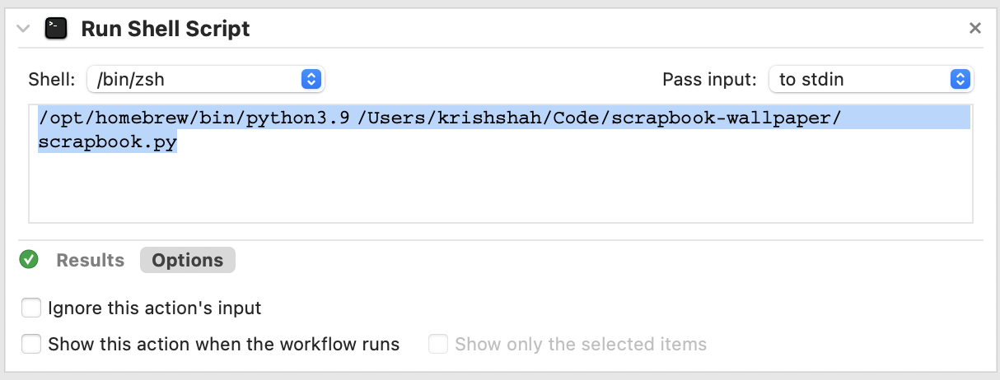

# Scrapbook Wallpaper

This is a script that takes a folder of images and a base image, and turns it into a scrapbook wallpaper. It's a fun way to display your favorite images on your desktop.

https://github.com/user-attachments/assets/a5c1f0c3-f2d6-4f1c-9c1b-069b23513d36

**Features**
- Makes sure most recent screenshot is at the front
- Customizable background (base wallpaper)
- Automated wallpaper updating

## How to use

1. Clone the repository
2. Make a folder that will hold all of your scrapbook images
3. Replace `base_image_path`, `input_folder`, and `output_image_path` with the appropriate paths
4. `python scrapbook.py`
5. Check out your scrapbook at `output_image_path`!

## Automation with your desktop wallpaper

### Mac

I have my screenshot tool (`cmd` + `shift` + `5`) set to save to the `input_folder` by default. Quick tip: if you use the `cmd` + `shift` + `4` tool, you can hold `control` to copy the screenshot to your clipboard instead of saving it to the folder for other uses.

I also use MacOS automator to watch over my scrapbook folder and run my script whenever a new image is added. Here's how to do that:

Lastly, I have my desktop wallpaper set to cycle through the `output_image_path` every 5 seconds. This way, my wallpaper is always up to date with my latest screenshots.

> [!IMPORTANT]  
> You need to have two images in the folder so apple lets you rotate through the folder, then you can delete

### Windows and Linux

TBD

## Updates

Just hit me up on any platform and I'll be happy to make this work for you! I'm also open to pull requests.
